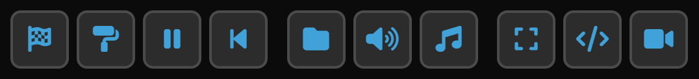

# 💡 Shaderbox - A WebGL Shader Playground

This project is a web based interactive editor for creating, running and testing WebGL2 (GLSL) shaders. Which in plain speak means, it uses your GPU to put pretty graphics on the screen!

Heavily inspired by [Shadertoy](https://www.shadertoy.com/) with some specific features I wanted for my own use, and creating things that already exist is sometimes fun 😛 It's written in 100% vanilla JS and uses Vite for bundling

Features:

- Interactive code editor with syntax highlighting using [Monaco editor](https://microsoft.github.io/monaco-editor/)
- Updates to shaders apply without interrupting rendering
- Shader compilation error highlighting
- A set of samples/examples to get you started
- Audio input support with spectrum analyser
- MIDI support, with notes and CC values
- Capture output video as MP4
- Simplex noise and random numbers
- Mouse input
- Post processing shader for a 2nd pass phase


## 🌐 Try it Out

Hosted on GitHub pages here: [https://shaderbox.benco.io/](https://shaderbox.benco.io/)

## 🚦 User Guide

When first opened it will load a default shader for you, which is a simple but cool looking realtime raytracer.

The toolbar is the main way to interact with the app



- Execute and run the shader code, also hitting Ctrl+S in the editor will do the same
- Switch editor to 2nd pass / post processing shader code (toggle)
- Pause or resume the rendering loop, pressing the spacebar will do the same
- Rewind time and restart the clock
- Open one of the provided sample and example shaders
- Configure audio and setup incoming audio device or microphone
- Configure MIDI input device
- Switch fullscreen, press escape to exit. Fullscreen can also be entered with a double click or tap.
- Toggle the code editor view on/off
- Capture the output view as a video, click button again to stop recording, and save the capture as a MP4 file.

Any code you enter is saved locally, and will be reloaded when you re-open the page.

## 🔦 Shader Developer Guide

The shader code you need to provide is a GLSL fragment shader, it needs to have a `main()` function but that is the only requirement. Do not include `#version` or `precision` as these are added automatically.

You are not working with any sort of 3D geometry or attribute buffers, the fragment shader runs over a 2D quad which covers the screen and output frame.

The only output is `fragColor` which is a vec4, to hold the colour of the output pixel.

Simplest example

```glsl
// Output all red pixels
void main() {
  fragColor = vec4(1.0, 0.0, 0.0, 1.0);
}
```

Press Ctrl+S to save and run the shader code and see your changes, or click the flag icon.

### Builtin Uniforms

There are several builtin uniforms provided and set automatically

```glsl
vec2 u_resolution       // Resolution of the output
float u_time            // Current time in seconds, advances every frame
float u_delta           // Time delta, usually constant
float u_aspect          // Aspect ration of the output
vec3 u_mouse            // Mouse coords in x & y, z holds mouse buttons

int u_analyser[]        // Audio frequency data from spectrum analyser
int u_analyser_size     // Size of the u_analyser array

sampler2D u_rand_tex    // Texture holding random values in R,G,B & A 256x256
sampler2D u_noise_tex   // Texture holding simplex noise 256x256
sampler2D u_midi_tex    // Texture holding 16x128 MIDI note & CC data
sampler3D u_noise_tex3  // Texture holding 3D simplex noise values
```

#### Uniforms for post processing shader

All the uniforms above are available plus two extra ones

```glsl
sampler2D image         // Framebuffer image from the 1st pass (main shader)
vec2 v_imgcoord         // Pixel coord into the above image
```

### Builtin Functions

There are several builtin functions provided

```glsl
// Get normalized pixel coords, taking aspect ratio into account
// Pass -0.5 as offset to center things
vec2 screenPos(float offset)

// Trig functions scaled to 0-1 range
sin01(float in, float scale)
cos01(float in, float scale)
tan01(float in, float scale)

// Convert HSV to RGB
vec3 hsv2rgb(float h, float s, float v)

// Helper to get audio frequency data, returns normalized value
float audioFreqData(int binIndex) {

// MIDI functions

// Get velocity (scaled to 0-1) note value of given note & channel
float midiNote(int chan, int note)

// Get CC value (scaled to 0-1) of given CC number & channel
float midiCC(int chan, int cc)

// Get highest note (scaled to 0-1) played on given channel
midiNoteAny(int chan)

// Random and noise functions
float goldNoise(in vec2 xy, in float seed)
float randGold(float r)
float randTex(float r)
float octaveNoise(vec2 pos, int octaves)
float octaveNoise3(vec3 pos, int octaves)
```
